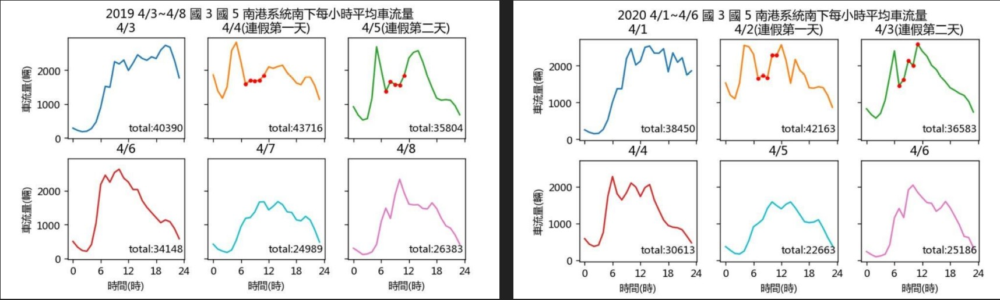
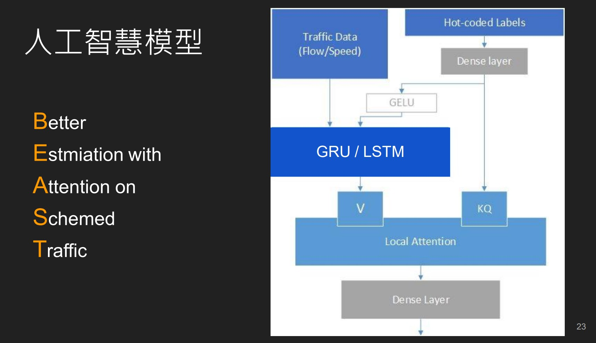
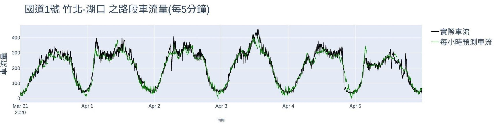
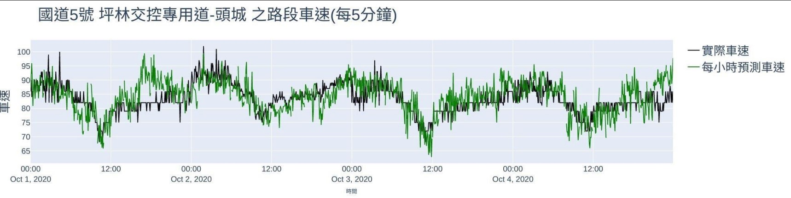
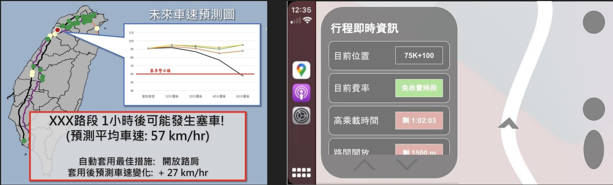

# Freeway-ETC2021
#### 第七屆 高速公路 ETC 資料在交通管理之應用 創意競賽

組別：截止到晚上八點，最多讚的當選

題目：解決連假時段之特定路段塞車問題與未來應用 - 透過數據分析與人工智慧模型解決塞車問題

名次：**決賽第三名**

## 實作內容

### 連假時段車流/車速分析

### B.E.A.S.T 車速車流預測模型

* 結合注意力機制和條件向量的序列神經網路模型

### 車速車流預測

### 未來展望

* 即時預測與自動套用措施
* 結合CarPlay等系統提供行車資訊

